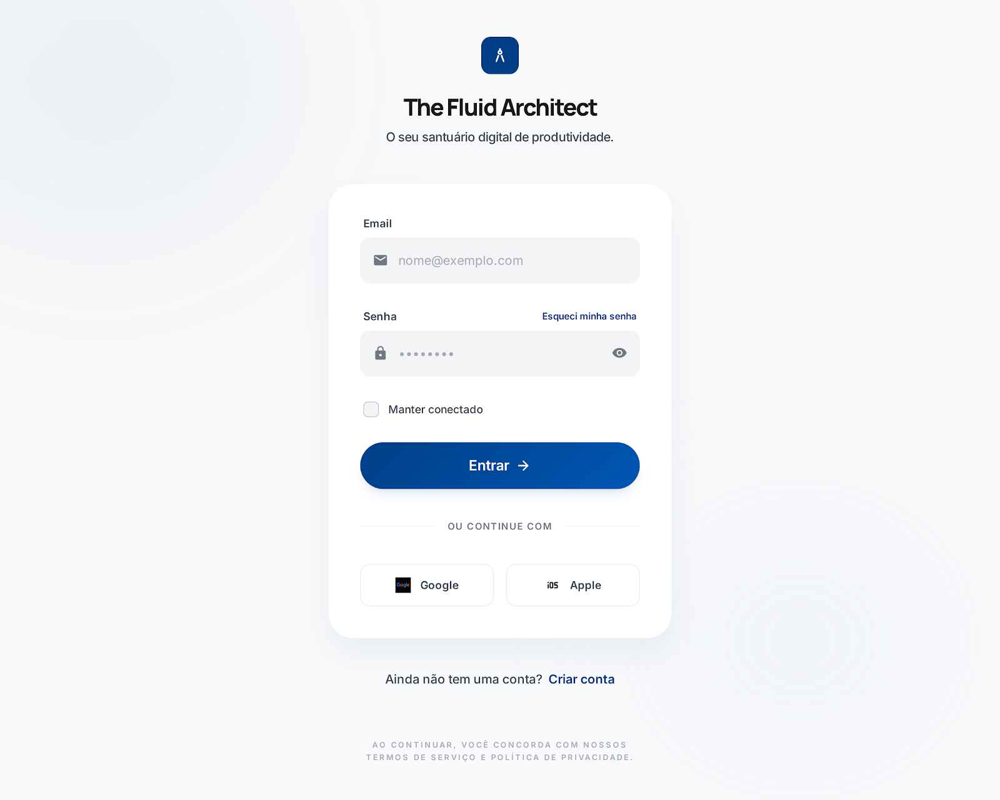
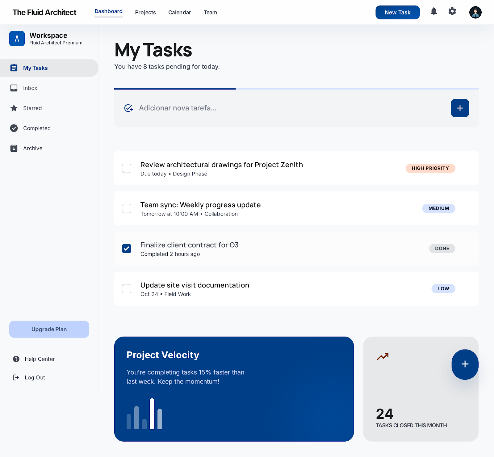

# UI Specification

## Telas

### Login
- Campo de email
- Campo de senha
- Botão de login

### Dashboard
- Lista de tarefas
- Campo para nova tarefa
- Botão de adicionar
- Checkbox para concluir tarefa

## Fluxo
Login → Dashboard → Gerenciamento de tarefas

## Protótipo (Stitch)

Protótipos gerados utilizando IA (Stitch) para validação rápida da interface antes da implementação.

### Tela de Login

### Dashboard

Os protótipos serviram como base para a implementação no frontend com Next.js.
